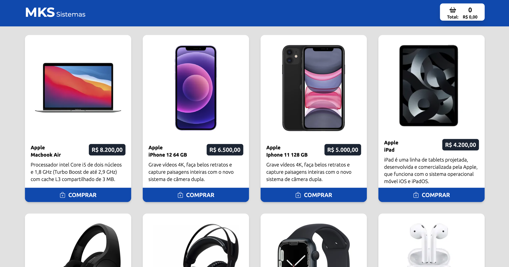

# Desafio - MKS Sistemas

Projeto desenvolvido referente ao desafio

## Visão geral

### Captura de tela

### Links

- [Em produção URL:](https://desafio-mks.ercdev.com.br/)

## Meu processo

### Construído com

- Semantic HTML5 markup
- [Nextjs](https://nextjs.org/) - React Framework
- [Jest](https://jestjs.io/) - Framework de Testes
- [Tailwind](https://tailwindcss.com/) - Utility-first CSS framework

## Autor

- [Me encontre](https://ercdev.com.br/)

# Diretrizes do desafio

O objetivo principal desse teste é avaliar sua capacidade de escrever código limpo, bem testado e reutilizável. Ao terminar, faça o deploy da aplicação e mande-nos o link.

## Tarefa (funcional)

Para esse desafio, você deve consumir nossa [API REST de produtos](https://mks-challenge-api-frontend.herokuapp.com/api-docs/) para exibir a lista de produtos da loja.

A aplicação deve conter apenas uma página/rota e um carrinho.

- <b>Loja</b>: A lista de produtos deve ser buscada de nossa API, use um shimmer/skeleton enquanto estiver em loading.

- <b>Carrinho</b>: O carrinho deve conter todos os produtos selecionados, juntamente com a opção de aumentar a quantidade de cada produto selecionado.

Use do Jest e a testing-library para realizar os testes unitários.

## Recursos

UI/UX: [Figma loja](https://www.figma.com/file/Z4z8osDbK1ET7cjNzFRMrK/MKS-Front-end-challenge?node-id=0%3A1) PS: O design system está incluso, incluindo a fonte.

API: [API REST de produtos](https://mks-challenge-api-frontend.herokuapp.com/api-docs/) para exibir a lista de produtos da loja.

## Ferramentas requeridas

1. TypeScript
2. React ou Next.js (Preferimos Next.js)
3. Redux toolkit
4. Styled-components
5. Jest

## Aspectos técnicos

Todas as ferramentas listadas anteriormente são mandatórias, além delas sinta-se livre para utilizar de qualquer outra technologia que te seja confortável.

## Faça o deploy!

Ao finalizar, faça o deploy no lugar que te for confortável (exemplo: Vercel, Netlify, Heroku, Amazon EC2, etc)
